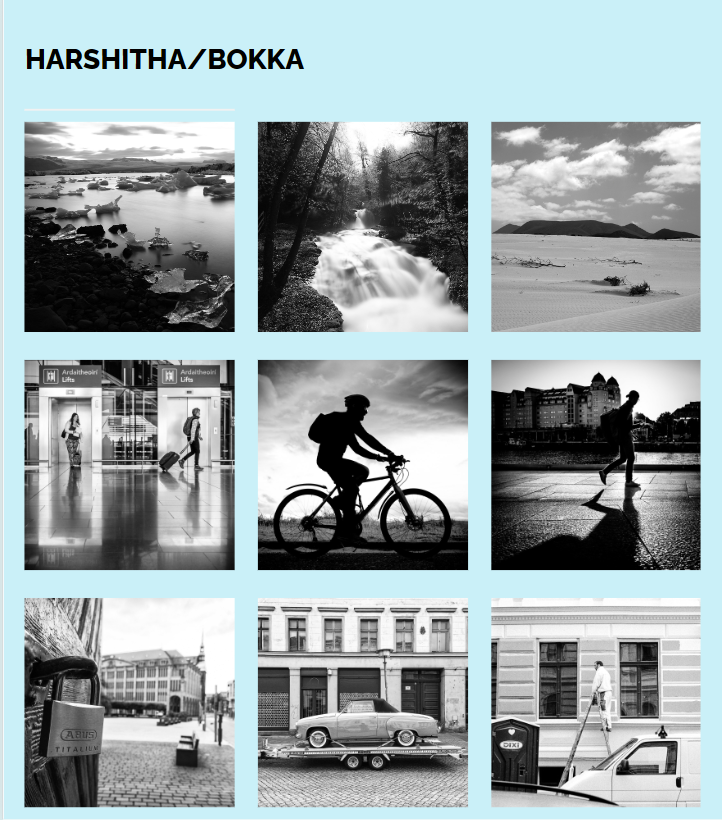

<h1>Photo Blog Project</h1>
This is a simple photo blog project created using HTML and CSS.

<h2>Project Overview</h2>
This project aims to showcase a collection of photographs in a visually appealing manner. It utilizes HTML for structuring the content and CSS for styling.

<h2>Features</h2>
Responsive design for compatibility across various devices.
Simple and intuitive navigation.
Clean and modern layout to highlight the photographs.
<h2>Usage</h2>
1.Clone the repository: 
Copy code:git clone https://github.com/bdsharshitha/Photo-Blog.git  
2.Open index.html in your web browser to view the photo blog.
<h2>Screenshot</h2>

<h2>Contributing</h2>
Contributions are welcome! Please feel free to submit pull requests.

<h2>License</h2>
This project is licensed under the MIT License.

<h2>Acknowledgements</h2>
Special thanks to <a href="https://unsplash.com/">Unsplash</a> for providing the beautiful photographs used in this project.
